# AI Integration — UI Tree Extraction & POM Generation

This document covers the architecture and workflow for AI-assisted Page Object Model (POM)
generation in the Mobilewright framework.

---

## The Core Philosophy: No Hallucinations

AI models are powerful at writing Mobilewright TypeScript code, but they are notoriously bad
at *guessing* how a mobile UI is structured. If an AI is asked to write locators for a screen
it cannot see, it will fabricate label keys and role strings that look correct but fail at runtime.

To solve this, we enforce an **Evidence-Based Pipeline**. The AI is strictly forbidden from
writing locators without physical evidence (a live accessibility tree dump from the device).
If it lacks evidence, it must run `npm run extract` first, validate the output, and *then* write the POM.

---

## The Workflow Architecture

The AI operates through two specialized skills (`mobilewright-ui-tree-extractor` and
`mobilewright-pom-builder`) that hand off to each other to achieve complete autonomy.

```mermaid
sequenceDiagram
    actor SDET
    participant Agent as AI Agent
    participant Extractor as mobilewright-ui-tree-extractor
    participant Device as Android Device (ADB)
    participant POM as mobilewright-pom-builder

    SDET->>Agent: "Build POM for Home screen"

    rect rgb(50, 50, 50)
        Note right of Agent: Phase 1: Task Classification
        Agent->>Agent: Is this a new locator task?
        Agent->>Extractor: Yes — trigger extractor skill
        Extractor->>SDET: Ask screen name, pre-conditions, data state
        SDET-->>Extractor: "Home screen, needs login first"
    end

    rect rgb(50, 50, 50)
        Note right of Extractor: Phase 2: Evidence Gathering
        Extractor->>SDET: "Navigate to the Home screen, then run:"
        Note right of Extractor: npm run extract -- home
        SDET-->>Extractor: Command run ✅
        Device-->>Extractor: .ui-evidence/home-locators.yml (Gold)
        Device-->>Extractor: .ui-evidence/home-tree.json (Silver)
        Extractor->>Extractor: Validate output — labels exist, no system UI, text redacted
    end

    rect rgb(50, 50, 50)
        Note right of POM: Phase 3: POM Generation
        Extractor->>POM: Handoff structured candidate locator list
        POM->>POM: Write locators, actions, verify methods
        POM-->>SDET: Code ready for review ✅
    end
```



---

## The Two Outputs: Silver & Gold

When `npm run extract -- <screen>` runs, it produces two files in `.ui-evidence/`:

| File | Called | Purpose |
|---|---|---|
| `<screen>-locators.yml` | **Gold** | Flat, collapsed YAML locator summary. ~50 lines. This is the AI's primary input for writing locators. |
| `<screen>-tree.json` | **Silver** | Full filtered app-only JSON tree. Preserves hierarchy for debugging complex nested widgets. |

> **Token reduction:** ~94% (raw dump ~34KB → combined output ~2KB).
> System UI (status bar, nav bar) is fully stripped. User-entered text on `EditText` nodes
> is automatically `[REDACTED]`.

### Why two files?

The **Gold YAML** is optimized for AI consumption — it collapses invisible layout wrappers
and presents a flat, readable list of interactive elements. The AI reads this to write locators.

The **Silver JSON** preserves the exact widget hierarchy. It exists as a fallback for debugging
when a locator is failing due to complex nesting that the YAML doesn't expose.

---

## Extraction Options

### Option A — CLI Utility (recommended for local development)

Navigate to the target screen on your device first, then run:

```bash
npm run extract -- <screen-slug>

# Examples
npm run extract -- home
npm run extract -- login
npm run extract -- profile-edit
npm run extract -- home-with-egypt-selected    # specific data state
```

**Output:**
```
✅ UI Evidence saved for 'home':
   Silver: .ui-evidence/home-tree.json
   Gold:   .ui-evidence/home-locators.yml
   Token reduction: ~94% (34154 bytes raw → 2035 bytes combined)
```

**Slug validation** — slugs must be lowercase with hyphens only:
```
❌ Error: invalid screen slug "Home Screen"
   Use lowercase letters, numbers, and hyphens only. Examples: home, profile-edit, phase3
```

### Option B — AI-Orchestrated

Ask the agent directly. The agent will interview you for preconditions, instruct you to navigate
to the screen, run the extraction via the CLI utility, validate both outputs, extract a structured
candidate locator list, and hand off directly to `mobilewright-pom-builder`.

---

## When the AI RUNS the Extractor

The AI will trigger `mobilewright-ui-tree-extractor` if and only if:

- It is building a **brand new** Page Object and has no evidence.
- It is adding a **new locator** that is not backed by any existing evidence file.
- It is fixing **broken locators** caused by a UI change in the app.
- The evidence file for the screen is **stale** (e.g., the user says the screen changed).

## When the AI SKIPS the Extractor

The extraction loop is intentional overhead. The AI will bypass it and go directly to
writing code if:

1. It is composing **new action or verify methods** using *already existing* locators.
2. It is strictly **refactoring** POM structure, method signatures, or logic.
3. The user **explicitly provides** the new locator strategy in the prompt.
4. The user **pastes the Gold YAML** directly in the chat (inline evidence).

---

## How to Prompt the AI

Structure your prompt to include your **intent**, the **screen**, and the **preconditions**
(what app state is needed to reach it). This avoids unnecessary back-and-forth.

### Build a new POM from scratch

> *"Extract the UI tree for the Home screen (login required) and build the `HomePage` POM."*

> *"Build a POM for the Profile Edit screen. You need to login first, then tap the Profile tab,
> then tap Edit. Extract the tree and build `ProfileEditPage`."*

### Update locators after a UI change

> *"The Home screen was redesigned. Re-extract the tree and update the locators in `HomePage.ts`.
> No logic changes needed."*

### Provide the tree yourself (skip extraction entirely)

> *"Here is the content of `home-locators.yml`:*
> ```yaml
> elements:
>   - type: View
>     label: "Home"
>   ...
> ```
> *Build the `HomePage` POM from this."*

### Logic-only refactor (no extraction at all)

> *"Refactor `HomePage.ts` to combine `inputUsername` and `selectCountry` into a single
> composite method `fillPhase3Form(formData)`. No locator changes needed."*

> *"Add a `verifyCountrySelected(country)` verify method to `HomePage.ts` using the existing
> `getCountryDropdown` locator."*

---

## The Gold YAML Format

The Gold YAML file uses this structure. This is exactly what the AI reads to produce locators:

```yaml
# UI Evidence — home
# Generated: 2026-09-28T15:07:39.844Z
# Text values on EditText nodes are REDACTED.
# Use the labels and roles below to build Mobilewright locators.
# Locator priority: getByLabel > getByRole > getByText

elements:
  - type: View
    label: "LOGIN_INPUT_USERNAME"
    children:
      - type: EditText
        text: "[REDACTED]"
        focused: true
  - type: CheckBox
    label: "HOME_CHECKBOX_TERMS"
    checked: true
  - type: Button
    label: "Home\nTab 1 of 3"
    selected: true
```

From this, the AI writes:

```typescript
// Chained locator — container scopes the child
private getUsernameInput() {
  return this.screen
    .getByLabel('LOGIN_INPUT_USERNAME')
    .getByRole('textfield');
}

// Direct role locator
private getTermsCheckbox() {
  return this.screen.getByRole('checkbox', { name: 'HOME_CHECKBOX_TERMS' });
}

// Regex for multiline labels
private getHomeTab() {
  return this.screen.getByRole('button', { name: /Home/ });
}
```
